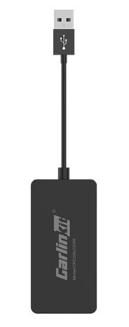

---
last_update:
  date: 2024-05-03
  author: 油腻樵夫
---

# 原车Android系统可以安装软件

## 适用场景

适用于原车不支持HiCar，也不支持CarPlay和CarLife，但车机系统是Android系统，并可以自行安装应用的车型。您可以通过自行在车上安装软件，然后配合盒子使用HiCar。

## 购买链接

| 序号  | 品牌       |  图片  | 购买链接 | 购买链接 |
| --- | -------- | --- | ---- | ----- |
| 1   | 车连易 |     |  [京东](https://u.jd.com/9i1Ijvp)   |  |

## 设备详情

### 车连易

<iframe src="https://omo-oss-video.thefastvideo.com/portal-saas/new2022022514431637379/cms/vedio/3472f310-2c82-4f51-8a4b-d133868bec08.mp4" scrolling="no" border="0" frameborder="no" framespacing="0" allowfullscreen="true" width="800" height="480"> </iframe>