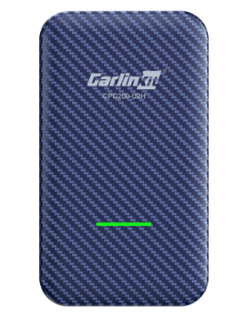
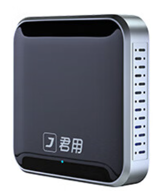
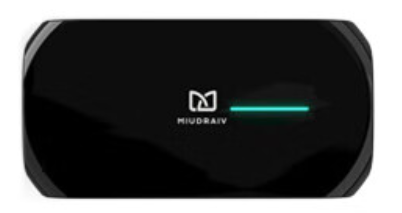
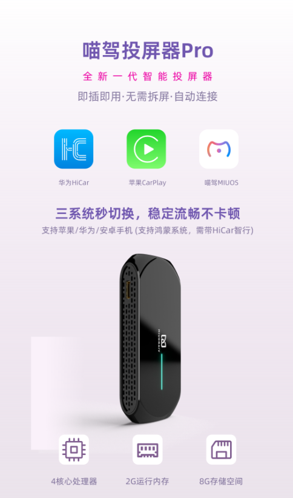

---
last_update:
  date: 2024-05-03
  author: 油腻樵夫
---

# 原车支持有线CarPlay

## 适用场景

适用于原车不支持HiCar，但支持苹果CarPlay的车型，因为现在有第三方的转换盒，可以通过CarPlay通道，让您原本不支持HiCar的车型也可以使用上HiCar。

:::tip

该场景仅适用于您的车支持有线CarPlay。例如：如果您的车只支持无线方式连接CarPlay，比如宝马的一些车型，则无法通过转换盒的方式使用上HiCar。

:::

## 检查方法

您在上车启动车辆后，在您车机的系统中查找CarPlay相关的菜单或按钮，一般在互联或者多媒体相关的子菜单里面。

或者访问下方的链接查看CarPlay的具体车型，查找您车型的支持情况：[支持CarPlay的车型](https://www.apple.com.cn/ios/carplay/available-models/)

## 购买链接

| 序号  | 品牌       |  图片  | 购买链接 | 购买链接 |
| --- | -------- | --- | ---- | ----- |
| 1   | 车连易 |     |  [京东](https://u.jd.com/9u1Lo6g)   |  |
| 2   | 君用 |     |  [京东](https://u.jd.com/9Q1LVQk)   |  [拼多多](https://p.pinduoduo.com/Xp3DCCjm)  |
| 3   | 喵驾 |     |  [京东](https://u.jd.com/9q1KOCU)   |   |

## 设备详情

### 车连易

<iframe src="https://jvod.300hu.com/vod/product/85640213-544a-4f8d-be9a-ebe95510f849/8794eab67c194eff87be1856d533255d.mp4?source=1&h265=1059h_231c0b254.mp4" scrolling="no" border="0" frameborder="no" framespacing="0" allowfullscreen="true" width="480" height="800"> </iframe>

### 君用

<iframe src="https://jvod.300hu.com/vod/product/120fd2c4-3b3c-48b5-8cc9-4ebf4815d3f9/a31d1e0397c84846bed7fec3bd7ecf5b.mp4?source=1&h265=1059h_c37863a53.mp4" scrolling="no" border="0" frameborder="no" framespacing="0" allowfullscreen="true" width="800" height="480"> </iframe>

### 喵驾

