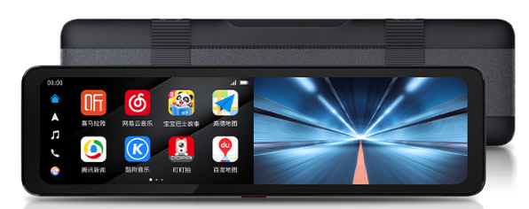
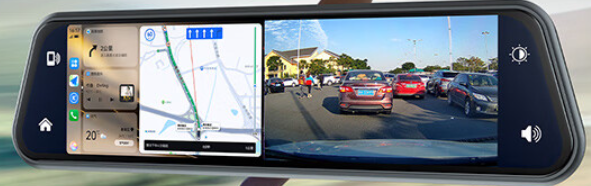

---
last_update:
  date: 2024-05-03
  author: 油腻樵夫
---

# 智能后视镜

## 适用场景

通过在原后视镜上捆绑智能后视镜的方式使用HiCar。

## 检查方法

您可以按照下图的示意，检查您车型的后视镜是否适合捆绑智能后视镜。

## 购买链接

| 序号  | 品牌       |  图片  | 购买链接 | 购买链接 |
| --- | -------- | --- | ---- | ----- |
| 1   | 盯盯拍智慧后视镜 |     |  [京东](https://u.jd.com/9zaexgG)   |   |
| 2   | 九音流媒体行车记录仪 |     |  [京东](https://u.jd.com/9baokzx)   |   |
## 设备详情

### 盯盯拍智慧后视镜

<iframe src="https://jvod.300hu.com/vod/product/ca62c519-8d03-4cc6-9bf9-0bc4bb8568f8/5035a634e38f454a970c3a77a03f9c2d.mp4?source=2&h265=h265/113074/0cdc15600bff4004be5da9243e18cb80.mp4" scrolling="no" border="0" frameborder="no" framespacing="0" allowfullscreen="true" width="480" height="800"> </iframe>

### 九音流媒体行车记录仪

<iframe src="https://jvod.300hu.com/vod/product/4c119224-8f59-4749-8ad8-74b88fd225ca/89904ac3084649b88197b8cb734a26ac.mp4?source=1&h265=1059h_78f4f83d6.mp4" scrolling="no" border="0" frameborder="no" framespacing="0" allowfullscreen="true" width="480" height="800"> </iframe>