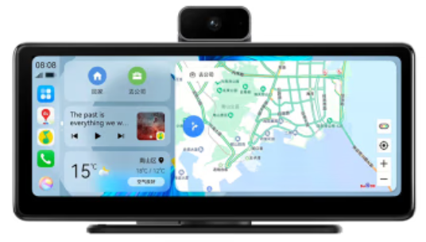
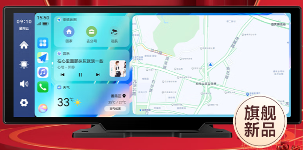

---
last_update:
  date: 2024-05-03
  author: 油腻樵夫
---

# 车载智慧屏

## 适用场景

车辆中控台平整的车型，可以通过车载智慧屏这种产品，即在中控台粘贴一块小的屏幕用于连接HiCar。

## 检查方法

您可以按照下图的说明，检查您车型的中控台形状及材质。

## 购买链接

| 序号  | 品牌       |  图片  | 购买链接 | 购买链接 |
| --- | -------- | --- | ---- | ----- |
| 1   | 盯盯拍车载智慧屏 |     |  [京东](https://u.jd.com/9iakDVL)   |    |
| 2   | 九音车载智慧屏 |     |  [京东](https://u.jd.com/9ia95hi)   |    |
## 设备详情

### 盯盯拍车载智慧屏

<iframe src="https://jvod.300hu.com/vod/product/8dcbf745-662f-4108-81cf-5d54c50e8297/444b2ff39b9747568f6882f4cb2dc16e.mp4?source=1&h265=v.f1059_h265.mp4" scrolling="no" border="0" frameborder="no" framespacing="0" allowfullscreen="true" width="480" height="800"> </iframe>

### 九音车载智慧屏

<iframe src="https://jvod.300hu.com/vod/product/aaff4087-932e-4914-99ab-bb27e7946304/e0d6da8d438b4343941ab0ebced37612.mp4?source=1&h265=1059h_0997b5a40.mp4" scrolling="no" border="0" frameborder="no" framespacing="0" allowfullscreen="true" width="480" height="800"> </iframe>

