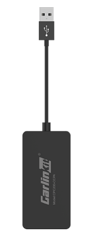

---
last_update:
  date: 2024-05-03
  author: Oily Woodcutter
---

# Vehicle with Android System Can Install Apps

## Applicable Scenarios

Applicable for vehicles that do not support HiCar natively, nor CarPlay or CarLife, but whose infotainment system runs Android and allows installing apps. You can install software on your vehicle and then use HiCar with a box.

## Purchase Links

| No. | Brand     | Image | Purchase Link | Purchase Link |
| --- | --------- | ----- | ------------- | ------------- |
| 1   | Carlinkit |     | [JD](https://u.jd.com/9i1Ijvp)   |  |

## Device Details

### Carlinkit

<iframe src="https://omo-oss-video.thefastvideo.com/portal-saas/new2022022514431637379/cms/vedio/3472f310-2c82-4f51-8a4b-d133868bec08.mp4#toolbar=0" scrolling="no" border="0" frameborder="no" framespacing="0" allowfullscreen="true" width="800" height="480"> </iframe>
