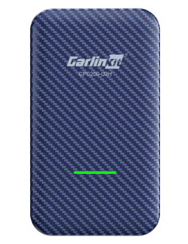
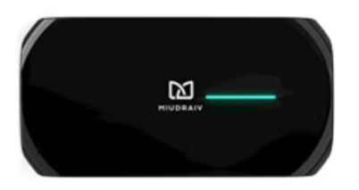

---
last_update:
  date: 2024-05-03
  author: Oily Woodcutter
---

# Vehicle Supports Wired CarPlay

## Applicable Scenarios

Applicable for vehicles that do not support HiCar natively but support Apple CarPlay. Since there are third-party conversion boxes available now, you can use the CarPlay channel to enable HiCar on vehicles that originally did not support it.

:::tip

This scenario only applies if your vehicle supports wired CarPlay. For example, if your vehicle only supports wireless CarPlay connection, such as some BMW models, you cannot use HiCar through a conversion box.

:::

## How to Check

After starting your vehicle, look for CarPlay-related menus or buttons in your vehicle's infotainment system, usually found under connectivity or multimedia submenus.

Or visit the link below to check specific CarPlay-compatible models and see if your vehicle is supported: [CarPlay Available Models](https://www.apple.com.cn/ios/carplay/available-models/)

## Purchase Links

| No. | Brand     | Image | Purchase Link | Purchase Link |
| --- | --------- | ----- | ------------- | ------------- |
| 1   | Carlinkit |     | [JD](https://u.jd.com/9u1Lo6g)   |  |
| 2   | Junyong   |     | [JD](https://u.jd.com/9Q1LVQk)   | [Pinduoduo](https://p.pinduoduo.com/Xp3DCCjm)  |
| 3   | Mdrive    |     | [JD](https://u.jd.com/9q1KOCU)   |  |

## Device Details

### Carlinkit

<iframe src="https://jvod.300hu.com/vod/product/85640213-544a-4f8d-be9a-ebe95510f849/8794eab67c194eff87be1856d533255d.mp4?source=1&h265=1059h_231c0b254.mp4#toolbar=0" scrolling="no" border="0" frameborder="no" framespacing="0" allowfullscreen="true" width="480" height="800"> </iframe>

### Junyong

<iframe src="https://jvod.300hu.com/vod/product/120fd2c4-3b3c-48b5-8cc9-4ebf4815d3f9/a31d1e0397c84846bed7fec3bd7ecf5b.mp4?source=1&h265=1059h_c37863a53.mp4#toolbar=0" scrolling="no" border="0" frameborder="no" framespacing="0" allowfullscreen="true" width="800" height="480"> </iframe>

### Mdrive

