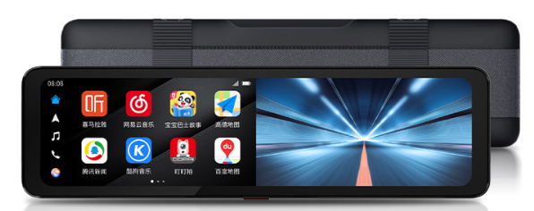
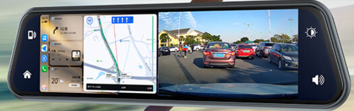

---
last_update:
  date: 2024-05-03
  author: Oily Woodcutter
---

# Smart Rearview Mirror

## Applicable Scenarios

Using HiCar by attaching a smart rearview mirror over the original rearview mirror.

## How to Check

You can check whether your vehicle's rearview mirror is suitable for attaching a smart rearview mirror according to the illustration below.

## Purchase Links

| No. | Brand | Image | Purchase Link | Purchase Link |
| --- | ----- | ----- | ------------- | ------------- |
| 1   | DDPai Smart Rearview Mirror |     | [JD](https://u.jd.com/9zaexgG)   |   |
| 2   | Jiuyin Streaming Media Dashcam |     | [JD](https://u.jd.com/9baokzx)   |   |

## Device Details

### DDPai Smart Rearview Mirror

<iframe src="https://jvod.300hu.com/vod/product/ca62c519-8d03-4cc6-9bf9-0bc4bb8568f8/5035a634e38f454a970c3a77a03f9c2d.mp4?source=2&h265=h265/113074/0cdc15600bff4004be5da9243e18cb80.mp4#toolbar=0" scrolling="no" border="0" frameborder="no" framespacing="0" allowfullscreen="true" width="480" height="800"> </iframe>

### Jiuyin Streaming Media Dashcam

<iframe src="https://jvod.300hu.com/vod/product/4c119224-8f59-4749-8ad8-74b88fd225ca/89904ac3084649b88197b8cb734a26ac.mp4?source=1&h265=1059h_78f4f83d6.mp4#toolbar=0" scrolling="no" border="0" frameborder="no" framespacing="0" allowfullscreen="true" width="480" height="800"> </iframe>
