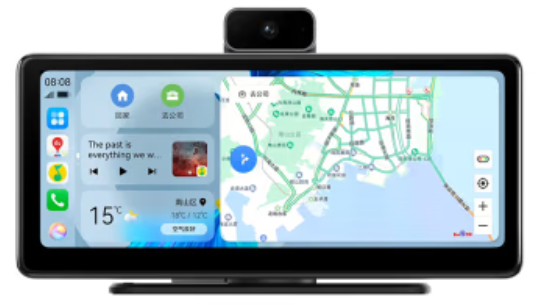
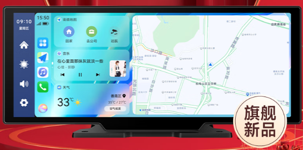

---
last_update:
  date: 2024-05-03
  author: Oily Woodcutter
---

# Vehicle Smart Screen

## Applicable Scenarios

For vehicles with a flat dashboard, you can use a smart screen product — attach a small screen to the dashboard to connect HiCar.

## How to Check

You can check the shape and material of your vehicle's dashboard according to the illustration below.

## Purchase Links

| No. | Brand | Image | Purchase Link | Purchase Link |
| --- | ----- | ----- | ------------- | ------------- |
| 1   | DDPai Smart Screen |     | [JD](https://u.jd.com/9iakDVL)   |    |
| 2   | Jiuyin Smart Screen |     | [JD](https://u.jd.com/9ia95hi)   |    |

## Device Details

### DDPai Vehicle Smart Screen

<iframe src="https://jvod.300hu.com/vod/product/8dcbf745-662f-4108-81cf-5d54c50e8297/444b2ff39b9747568f6882f4cb2dc16e.mp4?source=1&h265=v.f1059_h265.mp4#toolbar=0" scrolling="no" border="0" frameborder="no" framespacing="0" allowfullscreen="true" width="480" height="800"> </iframe>

### Jiuyin Vehicle Smart Screen

<iframe src="https://jvod.300hu.com/vod/product/aaff4087-932e-4914-99ab-bb27e7946304/e0d6da8d438b4343941ab0ebced37612.mp4?source=1&h265=1059h_0997b5a40.mp4#toolbar=0" scrolling="no" border="0" frameborder="no" framespacing="0" allowfullscreen="true" width="480" height="800"> </iframe>
