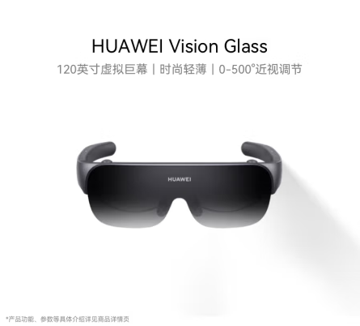

---
last_update:
  date: 2024-05-03
  author: Oily Woodcutter
---

# Smart Vision Glasses

Use HiCar with HUAWEI Vision Glass smart vision glasses in your vehicle. You can experience a 120-inch virtual giant screen while enjoying the stunning sound effects from your vehicle's original audio system.

## Purchase Links

| No. | Brand | Image | Purchase Link | Purchase Link |
| --- | ----- | ----- | ------------- | ------------- |
| 1   | HUAWEI Vision Glass Smart Vision Glasses |     | [JD](https://u.jd.com/9saol8H)   |     |

## Demonstration

## Usage Instructions

For detailed usage instructions, please refer to the user manual section on [HiCar In-Car Virtual Cinema](./../devices/vision-glass-hicar).
